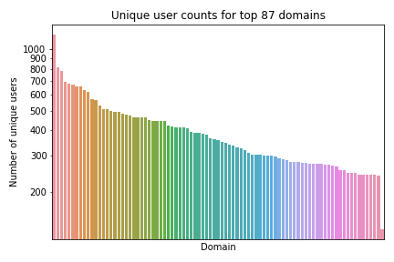

# Facebook Report Verification

This repository contains data and analysis methods from the methodology, "[How
We Investigated Facebook's Most Popular
Content](https://themarkup.org/show-your-work/2021/11/18/how-we-investigated-facebooks-most-popular-content)."

This methodology is an accompaniment to the story "[Facebook Isn’t Telling You
How Popular Right-Wing Content Is on the
Platform](https://themarkup.org/citizen-browser/2021/11/18/facebook-isnt-telling-you-how-popular-right-wing-content-is-on-the-platform)"
from from our series, [Citizen
Browser](https://themarkup.org/citizen-browser/). 

Citizen Browser's construction and methodology is described in "[How We Built a
Facebook
Inspector](https://themarkup.org/citizen-browser/2021/01/05/how-we-built-a-facebook-inspector)."

## Setup

Install the requirements using `pip install -r requirements.txt` then view analysis.ipynb using `jupyter notebook`. Most of the calculation work happens in [analysis.py](analysis.py).

## Analysis of results

The Facebook report also provides us with an opportunity to determine how
representative our panel is by comparing the list of top domains provided in
Facebook’s report with our panel’s top domains calculated in the same way.

To do this, we generated a list of top domains by number of unique users who
have seen a link to that domain within the same period as the Facebook Q3
report.  All of the 20 domains listed in Facebook’s report appear within the
top 189 domains of our Citizen Browser dataset. However, when we remove the
anomalous domain of "paypal.com," we see the remaining 19 domains listed in
Facebook's report within our top 39 domains. (We believe paypal.com is
anomalous because it was shared via private posts, which are not captured by
Citizen Browser.)

Figure 2 shows the distribution of the number of panelists who were shown the
domains from our list in their Facebook news feeds.

Unique User Counts for Top Domains Across Citizen Browser and Facebook (U.S.)

Source: The Markup Citizen Browser project, July 1–Sept. 30, 2021/Facebook
Widely Viewed Content Report

Fig 2

We can then use the Kendall Tau-c rank correlation coefficient to get a sense
of how comparable our list is with the Facebook report’s list. Kendall Tau-c is
used because of its specificity in correlating the similarity between ordered
lists of categorical values. (Categorical variables are difficult here because
they are not orderable. That is to say, we can say two domains are the same or
not, but we can’t say how similar they are.) 

Kendall Tau-c specifically looks at the relative ordering of two lists of data.
However, because the Facebook report only provides a list of 20 domains, while
our list contains 189 domains, we must calculate the correlation coefficient by
first taking the intersection of the two lists (i.e., deleting domains in our
list that don’t appear in the Facebook list, while maintaining their relative
ordering). The resulting data can be seen in Figure 5. While this may have a
biasing effect in our correlation coefficient, we attempt to resolve this by
explicitly calculating our p-value through simulation. In addition, we computed
the rank-biased overlap coefficient for the two lists and achieved similar
results of rbo = 0.698 using the extrapolated RBO calculation.

We find that the domain orderings have a Kendall Tau-c ranking correlation of
τ=0.411 with a p-value of p = 0.0111. A correlation value of τ = 0.411
represents a very strong correlation between the two rankings of domains (a
correlation value of 1 means a perfect match and 0 means no correlation
whatsoever). Anything above 0.3 for Kendall Tau is considered a strong
correlation.

In addition, the p-value gives us high confidence that this value is not the
result of random data. This p-value was calculated explicitly by randomly
shuffling our list of domains and re-running our analysis (see Figure 3). In
this test we found that 98.89 percent of randomly generated lists had a worse
correlation coefficient than our list did, giving us good statistical
confidence that our results are representative.

It is important to note that this correlation only shows that our rankings are
ordered similarly to the Facebook rankings. Because of the requirement to find
the intersection of the two lists, and the fact that Kendall Tau-c doesn’t take
absolute ranking into account, the correlation is unaffected by how many
“intermediate” domains there are between two matches to the Facebook list.
However, the observation that we only need a list of 189 domains to have
coverage over the Facebook list gives us confidence that this result is
significant.

Correlation value of top Citizen Browser domains and top Facebook domains
compared against randomly ordered lists

Source: Citizen Browser/Facebook /The Markup simulated data

Fig 3

To further address the caveats to the Kendall Tau-c analysis, we computed the
correlation between the unique user counts for our domains and the domains from
the Facebook report. This should tell us whether the number of users being
shown the domains in the Facebook list and our own list scale linearly with
each other.

To do this we again find the intersection of our domain list with the Facebook
report domain list so we are comparing like quantities, but this time we use
the Spearman correlation coefficient to show similarity between the number of
unique users seeing that domain. The data in this calculation can be seen in
Figures 4 and 5. We are able to use the Spearman coefficient because we are now
operating with numerical variables and not categorical variables. This method
looks specifically at whether the numbers trend in a similar way. We found a
correlation of ρ = 0.568 and a p-value of p = 0.009, which again is a strong
correlation. This shows that even though Facebook and The Markup are
calculating rankings from very different audience sizes, the numbers scale in
the same way and can be compared to each other.

Unique user count of top 20 domains as reported by Facebook against same
domains’ user count in Citizen Browser data

Source: Citizen Browser/Facebook Widely Viewed Content Report

Fig 4

From this analysis we can conclude that our data is a good match to the
released Facebook data and that our sample is sufficient for statistical
relevance. This means we can be confident in our conclusions based on our
sample size.

