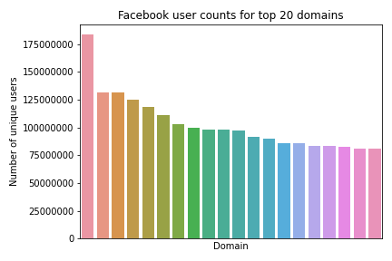
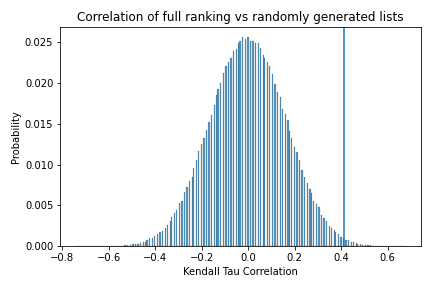
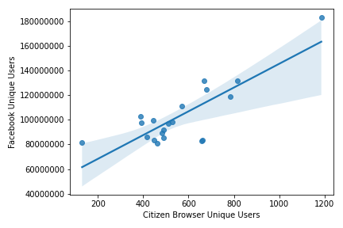
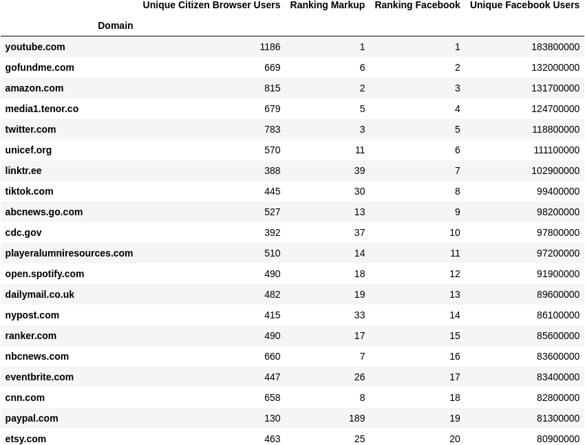

# Facebook Report Verification

## Setup

Install the requirements using `pip install -r requirements.txt` then view analysis.ipynb using `jupyter notebook`. Most of the calculation work happens in [analysis.py](analysis.py).

## Analysis of results

The facebook transparency report also provides us with an opportunity to determine how representative our Facebook panel is, by comparing the results of Facebook’s most viewed list with our panel’s most viewed content. To do this, we generated a list of top domains by number of unique users who have seen a link to that domain within the same period as the facebook Q2 report. Our list of top domains encompasses 90,603 domains. Figure 1 shows the distribution of the number of panelists who were shown the top 100 domains from our list in their Facebook news feeds.

Fig 1

We can then use the Kendall Tau-c rank correlation coefficient to get a sense of how comparable our list is with the Facebook report’s list. Kendall Tau-c is used because of its specificity in correlating the similarity between ordered lists of categorical values. It specifically looks at the relative ordering of two lists of data. However, because the Facebook report only provides a list of 20 domains, while our list contains 90,603 domains, we must calculate the correlation coefficient by first taking the intersection of the two lists (ie: deleting domains in our list that don’t appear in the Facebook list, while maintaining their relative ordering). The resulting data can be seen in Fig 4. While this may have a biasing effect in our correlation coefficient, we attempt to resolve this by explicitly calculating our p-value through simulation. (In addition, we computed the Rank-Biased Overlap coefficient for the two lists and achieved similar results of rbo=0.49.)

We find that the domain orderings have a Kendall Tau-c ranking correlation of τ=0.463 with a p-value of p=0.0019. A correlation value of τ=0.463 represents a very strong correlation between the two rankings of domains (a correlation value of 1 means a perfect match and 0 means no correlation whatsoever). Anything above 0.3 for Kendall Tau is considered a strong correlation. 

In addition, the p-value  gives us high confidence that this value is not the result of random data. This p-value was calculated explicitly by randomly shuffling our list of domains and re-running our analysis (see figure 2). In this test we found that 99.81% of randomly generated lists had a worse correlation coefficient than our list did, giving us good statistical confidence that our results are representative.

Fig 2

In addition, we computed the correlation between the view counts between our domains and the domains from the Facebook report. Again, we intersect our domain list with the Facebook report domain list so we are comparing like quantities, but this time we use the Spearman correlation coefficient between the number of unique views of that domain. The data in this calculation can be seen in Fig 3 and Fig 4. We are able to use the Spearman coefficient because we are now operating with numerical variables and not categorical variables. This method looks specifically at whether the numbers trend in a similar way. We found a correlation of ρ=0.589 and a p-value of p=0.00629, which again is a very strong correlation. This shows that even though the scale of numbers between Facebook and The Markup is clearly different, the numbers scale in the same way and can be compared to each other.

Fig 3

From this analysis we can conclude that our data is a good match to the released Facebook data and that our sample is sufficient for statistical relevance. This means we can be confident in our conclusions based on our sample size.

